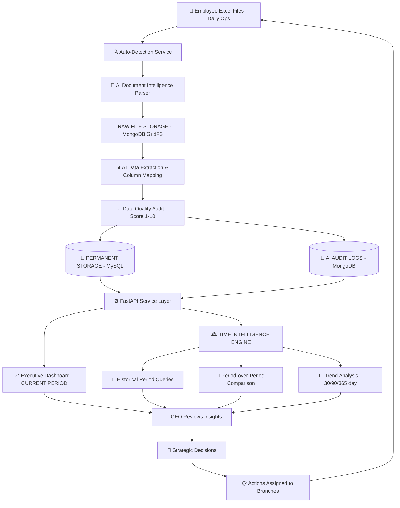

# Hugamara Executive Intelligence Hub v5.0.0
## System Architecture & Technical Documentation

### 1. Project Overview
The **Hugamara CEO Portal** is a premium, strategic intelligence platform designed to provide the Group CEO with a "Single Source of Truth" across the group's two primary business units. The system transforms operational data into high-fidelity financial insights using a Neural AI extraction engine.

---

### 2. Technical Stack
#### **Frontend (Executive Command Layer)**
- **Framework**: Next.js 14+ (App Router)
- **Styling**: Tailwind CSS 4.0 (Custom Glassmorphism v2)
- **Visuals**: Recharts (Kinetic Data Rendering)
- **Typography**: Playfair Display (Executive), Inter (Operations), JetBrains Mono (Financial)

#### **Backend (Neural Engine)**
- **Framework**: FastAPI (Asynchronous Python)
- **AI Extraction**: OpenAI & Azure AI Document Intelligence
- **Persistence**: Hybrid Storage (MySQL for Ledgers, MongoDB GridFS for Excel Asset Management)

---

### 3. Core Modules & Functionality

#### **A. Executive Summary (The Command Hub)**
**6-Key Metric Display:**
1. **Total Sales**: UGX Consolidated revenue with trend delta.
2. **Procurement**: Total spend across all branches.
3. **Pending**: Outstanding vendor liabilities.
4. **Inventory**: Real-time asset value of stock on hand.
5. **Gross Margin**: Percentage-based profitability indicator.
6. **Active Alerts**: Critical operational anomalies needing attention.

**Strategic Visuals:**
- **Sales vs Procurement Spend Chart**: Dual line (Solid Gold vs Dashed Emerald) for margin pressure detection.
- **Top Vendors Summary**: High-level spend and fulfillment rate auditing.

#### **B. Neural Hub (Strategic Decision Support)**
- **Consultant Mode**: AI chat interface for deep-audit interrogation.
- **Alert Shield**: Categorized operational anomalies (Critical/Warning/Info).

#### **C. Data Ingestion Service (Excel Asset Management)**
- **Automatic Detection**: Service layer that detects and versions Excel reports.
- **Permanent Storage**: Every file preserved in **MongoDB GridFS** with full version history and **SHA-256 integrity hashes**.
- **Neural Extraction**: Extraction Confidence powered by **Neural Vision v4.0** with confidence scoring (1-10).
- **Automation Strategy**:
    - **Employee Folders Syncing**: A background worker monitors branch-specific shared directories (Patiobella/Eateroo). As soon as an employee saves a file, the system detects the change and triggers an extraction.
    - **Polling Email Stream**: The system polls a dedicated group procurement email (e.g., reports@hugamara.com) to automatically ingest attachments sent by vendors or staff.

#### **D. Time Intelligence Engine (NEW)**
- **Global Time Navigator**: Persistent selector for Today, Week, Month, Quarter, Year, and Custom Range.
- **Period Comparison**: Side-by-side analysis of two distinct time periods (e.g., Feb 2026 vs Feb 2025).
- **Historical Snapshots**: Monthly summaries stored for long-term trend analysis.

#### **E. Procurement Intelligence (Detailed Views)**
- **Requisition Flow**: Tracking from kitchen request to approval.
- **LPO & GRN Sync**: Monitoring the 3-way match (LPO vs GRN vs Invoice).
- **Vendor Balances**: Real-time ledger showing Total Received, Paid, and Migrated Opening balances.

#### **F. Inventory Intelligence (Detailed Views)**
- **Month-End Snapshots**: Critical variance tracking (System vs Physical) with reason-code auditing.
- **Low Stock Alerts**: Predictive warnings based on current consumption velocity.

#### **G. Finance Intelligence (Detailed Views)**
- **Invoice Aging**: Bucketed liabilities (0-30, 31-60, 61-90, 90+ days).
- **Petty Cash Summary**: Ledger-derived snapshots of daily branch liquidity.
- **Payments Log**: Detailed audit trail of all Bank and Cash disbursements.

---

### 4. Data Flow Architecture

---

### 5. Design Philosophy & Governance

#### **Brand Identity Distinction**
- **PATIOBELLA (Fine Dining)**: Executive Gold (#d97706), 🍽️ Icon, Serif Typography.
- **EATEROO (QSR)**: Emerald Green (#10b981), 🥗 Icon, Sans-Serif Typography.

#### **Currency Intelligence Layer**
- **Default Currency**: UGX (Ugandan Shilling).
- **Formatting**: `UGX 1,234,567`.
- **Large Context**: K (Thousands), M (Millions), B (Billions).

#### **Mobile Experience**
- Responsive breakpoints at 1280px, 1024px, 768px.
- Frozen table columns and stackable cards for smaller viewports.

---

### 6. Database Schema (v5.0.0 Additions)

#### **Essential MySQL Tables:**
- `excel_uploads`: Metadata for GridFS files and AI audit scores.
- `monthly_snapshots`: Cached totals for historical time navigation.
- `vendor_balances`: Running totals with `migrated_opening`.
- `inventory_variance`: System vs Physical audit logs.

---

*Document Version: 5.0.0*  
*Last Updated: February 11, 2026*
